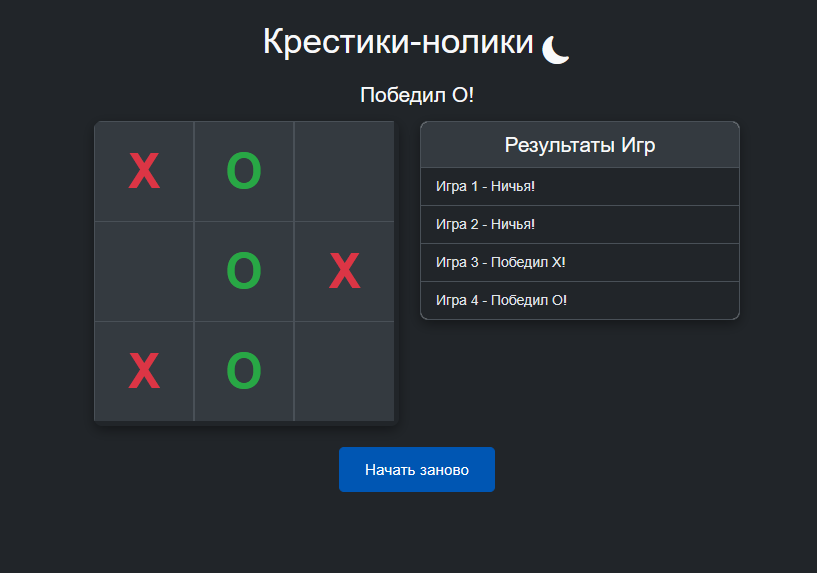

## Предварительный просмотр

 

# Крестики-нолики на Bootstrap 5 и JavaScript

Этот проект представляет собой простую игру в Крестики-нолики, реализованную с использованием Bootstrap 5 для адаптивного дизайна и современного внешнего вида, а также чистого JavaScript для игровой логики. Игра поддерживает переключение между светлой и темной темами и ведет учет результатов последних игр.

## Демонстрация

[Ссылка на GitHub Pages](https://FrankFMY.github.io/tictactoe-jquery-bootstrap/) 

## Особенности

*   **Адаптивный дизайн:** Полностью адаптивный интерфейс, разработанный с помощью Bootstrap 5.
*   **Игровая логика:** Чистый JavaScript для обработки ходов, проверки побед и ничьих.
*   **Переключение тем:** Возможность переключаться между светлой и темной темами.
*   **Учет результатов:** Отображение результатов последних пяти игр.
*   **Доступность:** Использование ARIA-меток для улучшения доступности.

## Технологии

*   **HTML5:** Структура страницы.
*   **CSS3:** Стилизация, включая кастомные стили и переменные Bootstrap.
*   **JavaScript (ES6+):** Основная игровая логика и манипуляции с DOM.
*   **Bootstrap 5:** Фронтенд-фреймворк для быстрого создания адаптивного дизайна.
*   **Bootstrap Icons:** Для иконок (например, переключения темы).
*   **jQuery:** Используется для упрощения работы с DOM и обработки событий.

## Установка и запуск

Для запуска проекта локально выполните следующие шаги:

1.  **Клонируйте репозиторий:**
    ```bash
    git clone https://github.com/FrankFMY/tictactoe-jquery-bootstrap.git
    ```
2.  **Перейдите в директорию проекта:**
    ```bash
    cd tictactoe-jquery-bootstrap
    ```
3.  **Откройте `index.html`:**
    Просто откройте файл `index.html` в вашем веб-браузере. Все необходимые стили и скрипты подключаются через CDN.

## Структура проекта

```
.
├── index.html    # Основная HTML-страница игры
├── style.css     # Кастомные CSS-стили, включая темную тему
└── app.js        # JavaScript-файл с игровой логикой и управлением UI
```

## Использование

*   Нажмите на любую пустую клетку, чтобы сделать ход.
*   Игроки чередуются: X и O.
*   Игра автоматически определяет победителя или ничью.
*   Нажмите кнопку "Начать заново", чтобы сбросить игру.
*   Используйте иконку солнца/луны для переключения между светлой и темной темами.

## Лицензия

Этот проект распространяется под лицензией MIT. Подробности см. в файле `LICENSE` (если применимо).